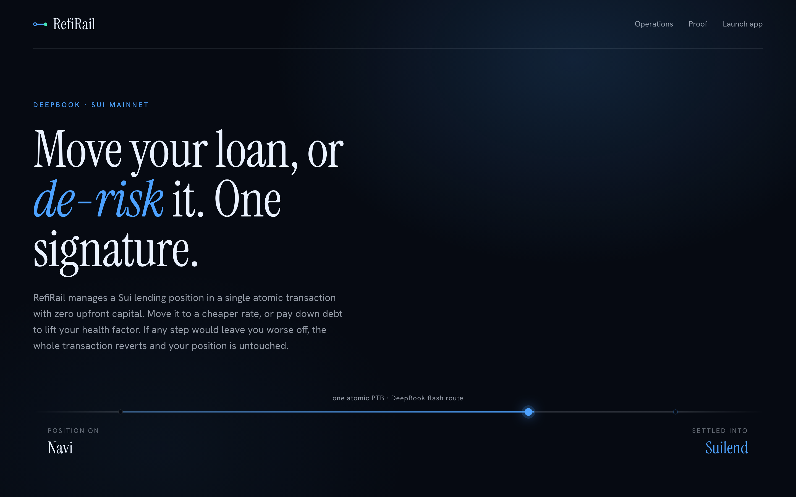

# RefiRail

Manage a Sui lending position in one click — move it to a cheaper rate, or de-risk it — as a single atomic transaction with zero upfront capital. If any step would leave you worse off, the whole transaction reverts and your original position is untouched.

**Live:** https://refirail.vercel.app · **Network:** Sui mainnet · **Track:** DeepBook



---

## The problem

Hundreds of millions in lending TVL sit across Navi, Suilend, and Scallop, and there is no tooling to move a position between them. A borrower stuck at a higher rate cannot slide their loan to a cheaper protocol: the unwind (repay debt → free collateral → redeposit → reborrow) needs capital you do not have while your collateral is still locked, and it is several separately-signed transactions where a failure midway can leave you under-collateralized.

The same is true for risk. When the market moves against you, paying down a slice of debt means selling collateral, repaying, and refreshing oracles — again, several fragile steps.

RefiRail collapses both into one click, because Sui's object model and Programmable Transaction Blocks let the entire multi-protocol sequence compose at the transaction layer and settle atomically.

## Two operations, one engine

**Reduce my risk (the DeepBook operation).** Pay down a chosen slice of your USDC debt using your SUI collateral, routed through DeepBook. Pick 25%, 50%, or 75% and the preview shows your debt falling, collateral falling, and — the number that matters — your health factor *rising*, before you sign.

**Move to a cheaper rate (the trust-builder).** Refinance a Navi USDC loan to the cheapest available money market in a single atomic transaction, without the capital to unwind it yourself. RefiRail reads the live borrow rate at both Suilend and AlphaLend and routes to whichever is cheaper, and you can override the destination by hand. Whichever venue you pick, the same PTB withdraws your collateral from Navi, deposits it into the destination, refreshes the oracle in-transaction, and reborrows your debt.

Both run server-side as a dry-run against live mainnet first, so the app only ever hands your wallet a transaction that has already been proven not to abort.

## How the deleverage works — one atomic PTB

1. **Flash-borrow USDC** from DeepBook (its flash primitive is fee-free).
2. **Repay a slice of the Navi debt** with the borrowed USDC.
3. **Withdraw the corresponding SUI collateral** from Navi (oracle refreshed in-PTB).
4. **Swap SUI → USDC** through DeepBook's whitelisted `DEEP/SUI` + `DEEP/USDC` pairs — a fee-free two-hop, with an enforced minimum output so the transaction reverts if the route can't deliver.
5. **Return the flash loan** exactly; sweep any surplus back to you.

The whole thing is one signature. The swap is where DeepBook does the real work: routing through the whitelisted DEEP pairs costs **0 DEEP in fees**, versus a direct `SUI/USDC` swap that would charge a DEEP taker fee the wallet doesn't hold. The live order-book panel shows both routes side by side and highlights the fee-free winner.

## Proven on mainnet

Every operation is real on Sui mainnet — no testnet, no mocks. The full ledger (33 signed operations plus atomic revert-proofs) lives in [`submission/proof.md`](submission/proof.md).

- **Atomic deleverage** (DeepBook flash + fee-free two-hop), health 1.89 → 2.92: [`4S5bhsgZ…`](https://suiscan.xyz/mainnet/tx/4S5bhsgZhsrwjaavUNBAZKyDwWKxKfruUTUXD6jT3S8K)
- **Atomic refinance** (Navi → Suilend, one PTB): [`BiMBPK7s…`](https://suiscan.xyz/mainnet/tx/BiMBPK7sLPc1F4DNv4GRseCoLVWPb2oxNdR33Ep8wdsK)
- **Atomic refinance, second destination** (Navi → AlphaLend, one PTB — the multi-lender router routing to a different money market): [`3UgVGY2y…`](https://suiscan.xyz/mainnet/tx/3UgVGY2ydYTRsQFAV7MFpxFe9frnFgJVFPhxbyFKuvL6)
- **Atomic partial refinance** (30% of a Navi loan moved to Suilend, the rest left in place at the same loan-to-value): [`8djvtzLp…`](https://suiscan.xyz/mainnet/tx/8djvtzLpTa36oLUYs2jWGzTsExRd7HQdDb46WBUbF3WF)

RefiRail deploys **zero net-new Move** — it composes Navi, Suilend, AlphaLend, DeepBook, and Pyth entirely at the PTB layer.

## Tech stack

- **Next.js 15** (App Router) — frontend + API route handlers (`/api/position`, `/api/preview`, `/api/deleverage`, `/api/deepbook`)
- **@mysten/sui v2** — PTB construction, JSON-RPC client, `dryRunTransactionBlock`
- **@mysten/dapp-kit** — wallet connect + client-side signing of server-built bytes
- **@mysten/deepbook-v3** — fee-free flash loan, fee-free two-hop swap, live order-book reads
- **@suilend/sdk** — refinance destination: obligation create / deposit / borrow
- **@alphafi/alphalend-sdk** — second refinance destination: position create / add collateral / borrow at the Move layer, with in-PTB Pyth refresh
- **@naviprotocol/lending** — refinance source: repay / withdraw
- **Pyth** — in-PTB oracle refresh

## API

| Method | Endpoint | Description |
|--------|----------|-------------|
| GET | `/api/position?address=` | Live Navi position + Navi/Suilend/AlphaLend borrow APRs + the cheapest-destination recommendation |
| POST | `/api/preview` | Build + dry-run the refinance PTB for a chosen destination (`destId: suilend \| alphalend`); returns signable bytes |
| POST | `/api/deleverage` | Size from a live DeepBook quote, build + dry-run; returns health-after + signable bytes |
| GET | `/api/deepbook` | Live mid price, two-hop vs direct route comparison, order-book depth |

## Running locally

```bash
npm install          # .npmrc sets legacy-peer-deps
cp .env.example .env.local   # add an RPC URL + a demo wallet key for the scripts
npm run dev          # http://localhost:3000
```

The page renders the demo position on first paint via `NEXT_PUBLIC_DEMO_ADDRESS`, even with no wallet connected. Preview and deleverage previews work with no wallet (server-side simulation); only signing is wallet-gated.

```bash
npm run test:unit    # sizing, health-after, route-selection math
npm run test:api     # malformed-input matrix across all four endpoints (needs dev server)
npm run test:e2e     # Playwright: flows, a11y, responsive, resilience
```

## License

MIT — see [LICENSE](LICENSE).
